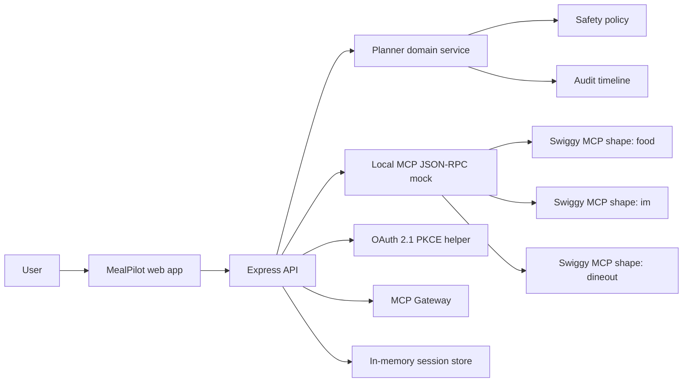

# Architecture

MealPilot is designed as an agentic commerce application with strict confirmation gates. The current implementation is a Vite + React + TypeScript app backed by an Express API and a local Swiggy MCP-style JSON-RPC mock. Once Swiggy staging credentials are issued, the server-side adapter can call the staging MCP endpoints without rewriting the product surface.

## Target Architecture



## Components

### Web App

- Planning workspace with prompt, budget, city, diet, and party controls.
- Household profile editor with allergy, dislike, cuisine, and consent fields.
- Budget, diet, location, and timing controls.
- Plan variants and item-level substitution controls before checkout.
- Separate confirmation panels for Food, Instamart, and Dineout.
- Simulated tracking after confirmation.
- Pantry, group planning, reminders, privacy export/delete, and ops status panels.
- Launch Center with MCP coverage, chat/voice response contracts, go-live checks, observability metrics, rollout plan, and support report generation.
- Demo Studio with cart preflight checks, offer opportunities, MCP replay transcripts, demo progress, and submission readiness.
- Production Evidence panel with Swiggy widget contracts, rate-limit budgets, version/deprecation monitoring, compliance controls, Resilience Lab drills, Evaluation Lab persona QA, and reviewer proof score.
- No checkout, order, or booking call is hidden inside a generic "continue" button.

### Planner Domain Service

- Normalizes user intent into structured planning state.
- Composes Food, Instamart, and Dineout recommendations.
- Produces an audit event for every tool-shaped call.
- Applies policy checks before risky tool calls.

Implementation:

- `src/domain/planner.ts`
- `src/domain/safety.ts`
- `src/domain/types.ts`

### Express API

- Owns plan sessions instead of keeping commerce state only in the browser.
- Validates requests with Zod.
- Executes confirmation actions through a server-side service.
- Supports item substitution, item removal, confirm-all, profile updates, tracking, and builder package export.
- Supports pantry restock suggestions, group constraints, schedule reminders, privacy export/delete, and operational status.
- Exposes the 35-tool Swiggy MCP catalog with demo-ready or guarded status for each Food, Instamart, and Dineout tool.
- Exposes `/api/mcp-gateway` for mock, staging, and production routing status, token posture, cutover steps, fallback behavior, and canary rollout.
- Generates chat-safe and voice-safe response payloads from the same plan session.
- Generates Swiggy-ready support reports with session IDs for escalation.
- Generates preflight reports before commercial actions, including budget, address, payment scope, item, confirmation, and substitution checks.
- Generates replayable JSON-RPC transcripts for the Swiggy MCP tool path.
- Generates a submission package that mirrors Swiggy access fields and manual-input gaps.
- Generates Evaluation Lab results across personas, cities, budgets, chat/voice surfaces, confirmation locks, and privacy checks.
- Generates Swiggy widget contracts with iframe sizing, postMessage events, sandbox policy, origin verification, and semantic fallbacks.
- Generates rate-limit, versioning, and compliance evidence aligned with Swiggy's Operate documentation.
- Generates resilience drills for safe 5xx retries, 429 Retry-After handling, 401 reauth, non-idempotent check-then-retry, and deprecation alerts.
- Serves OpenAPI 3.1 at `/api/openapi.json`, readiness checks at `/api/ready`, and request IDs on every API response.
- Ships with Docker, Render blueprint, GitHub Actions CI, and an automated production smoke verifier.
- Supports optional file-backed persistence through `MEALPILOT_DATA_FILE`, with versioned snapshots, restore, compaction, and storage diagnostics.
- Exposes an MCP-shaped local JSON-RPC route for Swiggy tool demos.
- Starts the Swiggy OAuth flow with server-stored PKCE verifier and state.

Implementation:

- `server/app.ts`
- `server/index.ts`
- `server/services/confirmationService.ts`
- `server/services/pkce.ts`
- `server/store/sessionStore.ts`

### Local MCP Stub

The localhost demo uses deterministic seeded data with the same domain boundaries that the real Swiggy MCP calls will need:

- `get_addresses`
- `search_restaurants`
- `get_restaurant_menu`
- `update_food_cart`
- `get_food_cart`
- `search_products`
- `your_go_to_items`
- `update_cart`
- `get_cart`
- `checkout`
- `track_order`
- `search_restaurants_dineout`
- `get_restaurant_details`
- `get_available_slots`
- `book_table`
- `get_booking_status`

The Launch Center maps every documented Swiggy MCP tool: 14 Food tools, 13 Instamart tools, and 8 Dineout tools.

Implementation:

- `server/mock/swiggyToolRouter.ts`
- `src/integrations/swiggy/mockClient.ts`
- `src/integrations/swiggy/client.ts`
- `src/integrations/swiggy/oauth.ts`
- `src/integrations/swiggy/retry.ts`

### MCP Gateway

The API keeps localhost demos on the deterministic mock router, but staging and production modes can route `/api/mcp/:server` to Swiggy's streamable HTTP endpoints when a bearer token is present. Tokens are held in process memory after OAuth callback or injected through a secure runtime variable for staging smoke tests; the full token is never returned in API responses.

Implementation:

- `server/services/mcpGateway.ts`
- `src/integrations/swiggy/client.ts`

### Swiggy MCP Clients

Planned server connections:

```ts
export const swiggyEndpoints = {
  staging: {
    food: "https://mcp-staging.swiggy.com/food",
    instamart: "https://mcp-staging.swiggy.com/im",
    dineout: "https://mcp-staging.swiggy.com/dineout",
  },
  production: {
    food: "https://mcp.swiggy.com/food",
    instamart: "https://mcp.swiggy.com/im",
    dineout: "https://mcp.swiggy.com/dineout",
  },
};
```

## Local Development Path

1. Run `npm run dev`.
2. Use the app on `http://localhost:5173`.
3. Show Food, Instamart, and Dineout cards created through `/api/plan`.
4. Confirm each action separately through `/api/confirm`.
5. Show audit timeline entries produced by the server.
6. Record the Builder Access video.
7. Once staging access is granted, swap the adapter to Swiggy staging.
8. Record a second demo against staging before requesting production.

## Production Path

- Host backend in an India-friendly region, preferably `ap-south-1`.
- Use HTTPS-only redirect URIs.
- Use a static NAT IP if Swiggy requests allowlisting.
- Store secrets in a managed secret store.
- Capture audit events for confirmation, cart mutation, checkout attempt, and booking attempt.

## Non-Goals

- No Swiggy catalogue scraping.
- No background bulk export.
- No competitor price comparison.
- No autonomous order placement.
- No training proprietary models on Swiggy user/order data.
