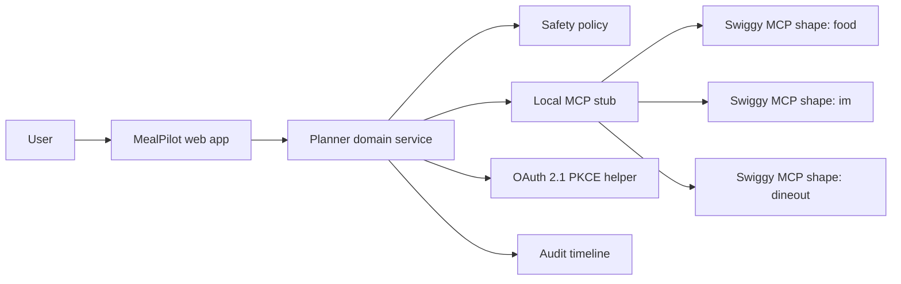

# Architecture

MealPilot is designed as an agentic commerce application with strict confirmation gates. The current implementation is a Vite + React + TypeScript app backed by a local Swiggy MCP-style adapter. Once Swiggy staging credentials are issued, the adapter can call the staging MCP endpoints without rewriting the product surface.

## Target Architecture



## Components

### Web App

- Planning workspace with prompt, budget, city, diet, and party controls.
- Budget, diet, location, and timing controls.
- Separate confirmation panels for Food, Instamart, and Dineout.
- No checkout, order, or booking call is hidden inside a generic "continue" button.

### Planner Domain Service

- Normalizes user intent into structured planning state.
- Composes Food, Instamart, and Dineout recommendations.
- Produces an audit event for every tool-shaped call.
- Applies policy checks before risky tool calls.

Implementation:

- `src/domain/planner.ts`
- `src/domain/safety.ts`
- `src/domain/types.ts`

### Local MCP Stub

The localhost demo uses deterministic seeded data with the same domain boundaries that the real Swiggy MCP calls will need:

- `get_addresses`
- `search_restaurants`
- `get_restaurant_menu`
- `update_food_cart`
- `get_food_cart`
- `search_items`
- `update_cart`
- `search_restaurants_dineout`
- `get_available_slots`

Implementation:

- `src/integrations/swiggy/mockClient.ts`
- `src/integrations/swiggy/client.ts`
- `src/integrations/swiggy/oauth.ts`
- `src/integrations/swiggy/retry.ts`

### Swiggy MCP Clients

Planned server connections:

```ts
export const swiggyEndpoints = {
  staging: {
    food: "https://mcp-staging.swiggy.com/food",
    instamart: "https://mcp-staging.swiggy.com/im",
    dineout: "https://mcp-staging.swiggy.com/dineout",
  },
  production: {
    food: "https://mcp.swiggy.com/food",
    instamart: "https://mcp.swiggy.com/im",
    dineout: "https://mcp.swiggy.com/dineout",
  },
};
```

## Local Development Path

1. Run `npm run dev`.
2. Use the app on `http://localhost:5173`.
3. Show Food, Instamart, and Dineout cards created from the local MCP stub.
4. Confirm each action separately and show audit timeline entries.
5. Record the Builder Access video.
6. Once staging access is granted, swap the adapter to Swiggy staging.
7. Record a second demo against staging before requesting production.

## Production Path

- Host backend in an India-friendly region, preferably `ap-south-1`.
- Use HTTPS-only redirect URIs.
- Use a static NAT IP if Swiggy requests allowlisting.
- Store secrets in a managed secret store.
- Capture audit events for confirmation, cart mutation, checkout attempt, and booking attempt.

## Non-Goals

- No Swiggy catalogue scraping.
- No background bulk export.
- No competitor price comparison.
- No autonomous order placement.
- No training proprietary models on Swiggy user/order data.
