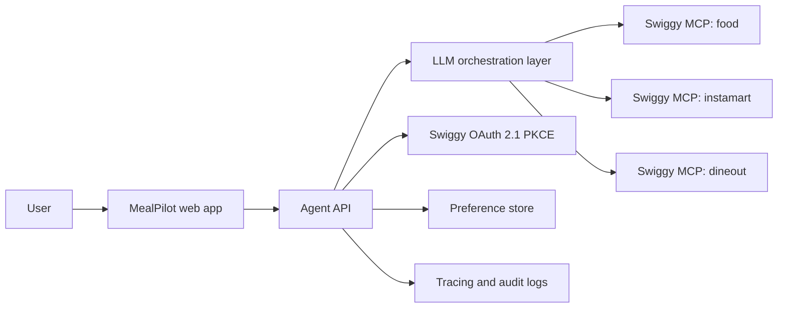

# Architecture

MealPilot is designed as an agentic commerce application with strict confirmation gates. The local prototype starts as a static UI plus stubbed MCP responses, then moves to a real backend once Swiggy staging credentials are issued.

## Target Architecture



## Components

### Web App

- Chat-first planning surface.
- Budget, diet, location, and timing controls.
- Separate confirmation panels for Food, Instamart, and Dineout.
- No checkout, order, or booking call is hidden inside a generic "continue" button.

### Agent API

- Normalizes user intent into structured planning state.
- Creates MCP clients per Swiggy server.
- Holds short-lived session state.
- Applies policy checks before risky tool calls.

### Swiggy MCP Clients

Planned server connections:

```ts
const food = new MCPServerStreamableHttp({
  url: "https://mcp.swiggy.com/food",
  requestInit: { headers: { Authorization: `Bearer ${token}` } },
});

const instamart = new MCPServerStreamableHttp({
  url: "https://mcp.swiggy.com/instamart",
  requestInit: { headers: { Authorization: `Bearer ${token}` } },
});

const dineout = new MCPServerStreamableHttp({
  url: "https://mcp.swiggy.com/dineout",
  requestInit: { headers: { Authorization: `Bearer ${token}` } },
});
```

## Local Development Path

1. Static prototype demonstrates the reviewer-facing user journey.
2. Local dev stub returns seeded Food, Instamart, and Dineout responses.
3. Agent API calls the stub through the same interface expected from MCP clients.
4. Once staging access is granted, swap stub URLs for Swiggy staging endpoints.
5. Record a second demo against staging before requesting production.

## Production Path

- Host backend in an India-friendly region, preferably `ap-south-1`.
- Use HTTPS-only redirect URIs.
- Use a static NAT IP if Swiggy requests allowlisting.
- Store secrets in a managed secret store.
- Capture audit events for confirmation, cart mutation, checkout attempt, and booking attempt.

## Non-Goals

- No Swiggy catalogue scraping.
- No background bulk export.
- No competitor price comparison.
- No autonomous order placement.
- No training proprietary models on Swiggy user/order data.
