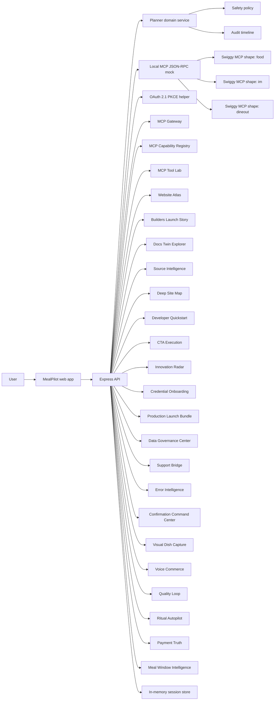

# Architecture

MealPilot is designed as an agentic commerce application with strict confirmation gates. The current implementation is a Vite + React + TypeScript app backed by an Express API and a local Swiggy MCP-style JSON-RPC mock. Once Swiggy staging credentials are issued, the server-side adapter can call the staging MCP endpoints without rewriting the product surface.

## Target Architecture



## Components

### Web App

- Carbon-inspired premium portal shell with a reusable MealPilot logo, sticky product header, mobile navigation, reviewer sidebar, footer, 12-column evidence grids, visible action notices, and section anchors for Planner, Recommendations, Launch Center, Production Evidence, Demo Studio, and Ops.
- Planning workspace with prompt, budget, city, diet, and party controls.
- Household profile editor with allergy, dislike, cuisine, and consent fields.
- Budget, diet, location, and timing controls.
- Plan variants and item-level substitution controls before checkout.
- Separate confirmation panels for Food, Instamart, and Dineout.
- Simulated tracking after confirmation.
- Pantry, group planning, reminders, privacy export/delete, and ops status panels.
- Launch Center with MCP coverage, Journey Compiler, Access Dossier, Access Evidence Matrix, Growth Partnership Center, Channel & Multimodal Studio, Visual Dish Capture Center, Voice Commerce Rehearsal Center, Quality Loop Center, Ritual Autopilot Center, Payment Truth Center, Meal Window Intelligence, Nutrition & Budget Intelligence, Household Preference Graph, Guest Collaboration & Calendar Center, Luxury Experience Workspace, Reviewer Artifact Vault, Visual QA Center, Premium Use Case Studio, Staging Cutover Rehearsal, Swiggy Staging Credential Drill Center, Staging Certification Matrix, Brand Compliance Kit, Capability Registry, Resource & Prompt Studio, Tool Contract Matrix, Widget Runtime Center, Commercial Action Guard, Website Atlas with access-page and launch-blog coverage, Builders Launch Story Center, Docs Coverage, Docs Twin Explorer, Upstream Watch, Source Intelligence, Deep Site Map, Developer Quickstart, CTA Execution, Innovation Radar, Tool Lab, Credential Cockpit, Support Bridge, chat/voice response contracts, go-live checks, observability metrics, rollout plan, and support report generation.
- Demo Studio with cart preflight checks, offer opportunities, MCP replay transcripts, staging transcript export, demo progress, and submission readiness.
- Production Evidence panel with Swiggy widget contracts, rate-limit budgets, version/deprecation monitoring, compliance controls, Source Intelligence, Deep Site Map, Developer Quickstart, CTA Execution, and Innovation Radar artifact links, Data Governance Center, Production Launch Bundle, Error Intelligence, Resilience Lab drills, Evaluation Lab persona QA, and reviewer proof score.
- No checkout, order, or booking call is hidden inside a generic "continue" button.

### Planner Domain Service

- Normalizes user intent into structured planning state.
- Composes Food, Instamart, and Dineout recommendations.
- Produces an audit event for every tool-shaped call.
- Applies policy checks before risky tool calls.

Implementation:

- `src/domain/planner.ts`
- `src/domain/safety.ts`
- `src/domain/types.ts`
- `src/assets/mealpilot-logo.svg`
- `docs/design-language.md`

### Express API

- Owns plan sessions instead of keeping commerce state only in the browser.
- Validates requests with Zod.
- Executes confirmation actions through a server-side service.
- Supports item substitution, item removal, confirm-all, profile updates, tracking, and builder package export.
- Supports pantry restock suggestions, group constraints, schedule reminders, privacy export/delete, and operational status.
- Exposes the 35-tool Swiggy MCP catalog with demo-ready or guarded status for each Food, Instamart, and Dineout tool.
- Exposes `/api/mcp/tool-lab` to probe every official Swiggy MCP tool with JSON-RPC request samples, response previews, route classes, safety gates, retry policies, and innovation use cases.
- Exposes `/api/mcp/tool-contract-matrix` as the all-tool contract layer for parameters, source/privacy labels, response envelopes, confirmation gates, retry policies, error buckets, and local fixtures.
- Exposes `/api/mcp/scenario-runner` as the executable official recipe layer for Food, Instamart, Dineout, and combined flows, with guard/recovery branches and all 35 tools covered.
- Exposes `/api/mcp/state-orchestrator` for Swiggy's multi-turn cart state, server-boundary, stale-cart recovery, and voice/chat surface rules.
- Exposes `/api/mcp/capability-registry` for tools, resources, prompts, OAuth metadata, widget registry, static metadata, and external gates.
- Exposes `/api/mcp/resource-prompt-studio` for concrete `resources/list`, `resources/read`, `prompts/list`, and `prompts/get` coverage across Food, Instamart, and Dineout.
- Exposes `/api/swiggy-builders-map` as the current Swiggy Builders website, CTA, capability, product-opportunity, and credential-gate source of truth.
- Exposes `/api/swiggy-website-atlas` as the header, docs subnav, footer, production-access page, launch blog, page-module, CTA, resource, and legal-link coverage artifact.
- Exposes `/api/swiggy-builders-launch-story` as the launch-blog story center that reconciles the April 2026 18+ tool narrative with the current 35-tool docs snapshot, reviewer demo journey, showcase assets, ecosystem lanes, CTA paths, and co-marketing gates.
- Exposes `/api/swiggy-operating-contract-center` as the operate-docs contract center for SLA, rate limits, support, versioning, changelog, launch traffic, runbooks, launch-review email, and external Swiggy gates.
- Exposes `/api/swiggy-builder-intake` as the action layer for every signup, apply, demo, contact, docs, and footer CTA, with submission fields, storyboard, drafts, owners, and gates.
- Exposes `/api/swiggy-faq-policy` as the FAQ and policy coverage center for homepage, developer, enterprise, access-guideline, footer-resource, allowed/restricted/prohibited, operating-principle, legal, and support-contact signals.
- Exposes `/api/swiggy-growth-partnership` as the launch-growth layer for get-noticed, hiring, co-branding, direct support, co-marketing, analytics, strategic guidance, experiments, metrics, proof assets, and partner asks.
- Exposes `/api/channel-multimodal-studio` as the developer-lane layer for voice, auto-restock, group bot, dietary planner, reservation, and screenshot-to-order builds, including local execution packets with route plans, response rules, confirmation gates, and telemetry contracts.
- Exposes `/api/swiggy-visual-dish-capture` and `/api/swiggy-visual-dish-capture/analyze` as the productized visual capture layer for dish photos, menu screenshots, pantry photos, and chat images, with label confirmation, no raw-image retention, Food/Instamart/Dineout route plans, telemetry, and vision or staging gates.
- Exposes `/api/swiggy-voice-commerce-center` and `/api/swiggy-voice-commerce-center/rehearse` as the productized voice layer for Food quick orders, Instamart restock, Dineout bookings, and combined plans, with short TTS scripts, card fallbacks, no raw ids, no raw-audio retention, and confirmation readbacks.
- Exposes `/api/swiggy-quality-loop-center` and `/api/swiggy-quality-loop-center/feedback` as the post-experience learning layer for consented preference tags, support-safe feedback routing, repeat optimization, and no raw Swiggy payload retention.
- Exposes `/api/swiggy-ritual-autopilot-center` and `/api/swiggy-ritual-autopilot-center/plan` as the recurring-routine layer for lunches, pantry resets, slotwatch, and weekend route planning with consented history, reminders, fresh reads, and no automatic commercial action.
- Exposes `/api/swiggy-payment-truth-center` and `/api/swiggy-payment-truth-center/reconcile` as the payment truth layer for cart totals, coupons, COD, Instamart bills, Dineout free bookings, paid-cart gates, and no payment-instrument retention.
- Exposes `/api/swiggy-meal-window-intelligence` and `/api/swiggy-meal-window-intelligence/forecast` as the timing layer for order, cook, reserve, track, and wait choices with fresh-read gates, advisory ETA risk buckets, no scheduled Food orders, and tracking cadence caps.
- Exposes `/api/nutrition-budget-intelligence` as the protein-per-rupee, coupon-safe cart, pantry-gap, group-budget, and Dineout balance layer for premium nutrition planning.
- Exposes `/api/household-preference-graph` as the consented personalization layer for Food active orders, Instamart go-to items/order history, Dineout saved-location signals, household weights, forecasts, and retention rules.
- Exposes `/api/guest-collaboration-calendar` as the group planning layer for guest votes, occasion templates, Dineout-first date nights, Food reminders, Instamart prep, calendar/share handoffs, and Slack/Teams gates.
- Exposes `/api/luxury-experience-workspace` as the polished reservation, Food cart, Instamart basket, combined evening, and recovery review layer with concierge modes, all-tool coverage, widget fallbacks, voice contracts, telemetry, and confirmation gates.
- Exposes `/api/reviewer-artifact-vault` as the access-submission manifest for proof links, OpenAPI, smoke commands, screenshot targets, demo-video checklist, logs, traces, redaction rules, support context, and Swiggy handoff copy.
- Exposes `/api/visual-qa-center` as the reviewer screenshot and layout evidence center for viewport targets, selector manifests, artifact paths, no-overlap rules, text-fit rules, widget fallbacks, mobile layout checks, redaction visibility, and automation/manual gates.
- Exposes `/api/swiggy-docs-coverage` as the 69-page `llms.txt` documentation coverage audit across Start, Build, Operate, Reference, and Blog.
- Exposes `/api/swiggy-docs-twin-explorer` as the paired markdown/rendered-page explorer for every official `llms.txt` page, including retrieval lanes, proof links, assertions, and drift gates.
- Exposes `/api/swiggy-upstream-watch` as the Swiggy docs/changelog watch center for `llms.txt`, `llms-full.txt`, v1.0 shipped/limited capabilities, v1.1/v1.2/v2 roadmap items, signed manifests, and required MealPilot follow-up actions.
- Exposes `/api/swiggy-source-intelligence` as the source reconciliation center for Builders website pages, CTAs, `llms` docs, markdown twins, 35-tool reference counts, drift signals, and build-queue actions.
- Exposes `/api/swiggy-deep-site-map` as the consolidated Builders website audit for every page, module signal, CTA, header/docs/footer link, proof path, source-reconciliation section, assertion, and external gate.
- Exposes `/api/swiggy-developer-quickstart` as the official developer quickstart workbench for readiness steps, framework adapters, first-call JSON-RPC drills, OAuth gates, commands, and recipe handoffs.
- Exposes `/api/swiggy-cta-execution-center` as the click-readiness workbench for every official Builders CTA, global header link, docs nav item, footer resource, mailto, form, and legal link with proof links, keyboard paths, browser actions, and operator gates.
- Exposes `/api/swiggy-innovation-radar` as the premium product strategy layer for Swiggy developer ideas, enterprise signals, access ground rules, support model, all-server MCP references, opportunity lanes, route optimizations, build phases, and partner gates.
- Exposes `/api/ai-client-connect-kit` as the AI-client and coding-agent connection kit for Claude Desktop, ChatGPT, Cursor, VS Code, Windsurf, MCP clients, SDK auth modes, and delegated-auth gates.
- Exposes `/api/brand-compliance-kit` as the Swiggy attribution and co-branding readiness artifact for Powered by Swiggy copy, asset gates, palette audit, surface placement, and screenshot review.
- Exposes `/api/data-governance-center` as the DPDP and data-handling artifact for Swiggy fiduciary/MealPilot processor roles, India/Singapore residency, tool-call PII inventory, DSR routing, retention, token redaction, security contacts, and signed-manifest readiness.
- Exposes `/api/swiggy-journey-compiler` as the official recipe route compiler for Food, Instamart, Dineout, combined journeys, premium three-server flows, confirmation gates, recovery reads, and all 35 tools.
- Exposes `/api/swiggy-access-dossier` as the production-access application dossier for Swiggy form fields, review checks, ground rules, legal readiness, track selection, proof links, manual inputs, and external gates.
- Exposes `/api/swiggy-access-evidence-matrix` as the reconciled reviewer ledger for official access fields, review checks, ground rules, legal terms, proof attachments, runbook steps, proof commands, owners, operator inputs, and Swiggy gates.
- Exposes `/api/premium-use-case-studio` as the premium product playbook matrix for differentiated MealPilot use cases, all-tool coverage, route optimization, surfaces, metrics, roadmap, and external gates.
- Exposes `/api/premium-concierge-itinerary` as the premium product itinerary layer for official Swiggy Food, Instamart, Dineout, and combined recipes, with all-tool coverage, saved-call optimizations, reminders, and confirmation gates.
- Exposes `/api/staging-certification-matrix` as the credential-aware staging plan that assigns all 35 Swiggy tools to smoke waves, OAuth/DCR checks, 48-hour soak, telemetry, rollback, and production-promotion gates.
- Exposes `/api/traffic-readiness-plan` as the launch capacity artifact for expected volume, peak QPS, per-lane traffic budgets, Retry-After handling, seven-day traffic-event notice, and staged rollout.
- Exposes `/api/mcp/backpressure-governor` as the adaptive runtime artifact for current Swiggy v1.0 upstream-shedder behavior, future `429`/`Retry-After`/`X-RateLimit-*` readiness, token buckets, voice burst shaping, tracking cadence, and background-job gates.
- Exposes `/api/swiggy-load-lab` as the capacity simulation workbench for synthetic pilot/campaign scenarios, lane ceilings, Retry-After drills, cohort ramps, operator actions, and external Swiggy gates.
- Exposes `/api/swiggy-offer-intelligence` as the coupon/deal/value workbench for Food coupon sequencing, Dineout deal validation, Instamart variant savings, offer drills, and no-blind-discount guardrails.
- Exposes `/api/swiggy-order-lifecycle` as the post-confirmation command center for Food, Instamart, and Dineout status tools, timeline states, non-blind retry probes, tracking cadence, telemetry, and support recovery.
- Exposes `/api/swiggy-location-trust` as the saved-address and location trust center for Food/Instamart `get_addresses`, Instamart address create/delete, Dineout saved locations, user-choice pauses, address switch refresh, and raw-address redaction.
- Exposes `/api/swiggy-cart-mutation-workbench` as the cart control room for Food cart readbacks, Instamart full-cart replacement, Dineout create_cart gates, payment-method truth, add-on confirmation, and checkout-safe mutations.
- Exposes `/api/swiggy-discovery-freshness` as the discovery control room for Food search/menu truth, Instamart product and go-to item variants, Dineout search/details/slots, pagination, coordinate consistency, and stale-result invalidation.
- Exposes `/api/swiggy-confirmation-command-center` as the final-commerce confirmation proof for Swiggy Food `place_food_order`, Instamart `checkout`, and Dineout `book_table`. It keeps official-source guardrails visible by requiring a fresh Food or Instamart cart read or Dineout slot read before approval, recording explicit user confirmation per action, splitting combined plans into separate approvals, probing order or booking status before any retry, deriving payment and free-booking truth only from Swiggy responses, and keeping live staging or production credentials as external gates.
- Exposes `/api/swiggy-cancellation-care-center` as the cancellation and care proof for Food and Instamart no-tool cancellation handling, official customer-care copy, Dineout booking-status recovery, `report_error` toolContext payloads, incident email boundaries, and planned error-code gates.
- Exposes `/api/swiggy-dineout-precision-center` as the Dineout commerce precision proof for free `book_table` reservations, standalone booking carts, `create_cart` bill-payment carts, paid-deal rejection, post-booking status probes, and live payment calibration gates.
- Exposes `/api/slo-incident-command` as the SLA and incident artifact for 99.9% uptime targets, latency bands, status-page fallback, incident comms, maintenance windows, measurement exclusions, and remediation evidence.
- Exposes `/api/mcp-gateway` for mock, staging, and production routing status, token posture, cutover steps, fallback behavior, and canary rollout.
- Exposes `/api/auth/swiggy/status` for Swiggy OAuth lifecycle status, authorize/token/logout endpoints, pending PKCE verifier count, callback outcome, token source, expiry, and storage policy without exposing bearer values.
- Exposes `/api/swiggy-auth-lifecycle-center` as the OAuth recovery and token-lifetime proof for PKCE S256, 120-second single-use codes, 5-day access tokens, no v1 refresh-token assumption, 401/419/403 re-auth decisions, exact redirect allowlisting, delegated per-user tokens, logout, secure storage, and no-token logging.
- Exposes `/api/credential-onboarding` for Swiggy OAuth metadata endpoints, Dynamic Client Registration preview, redirect URI audit, scope coverage, access-form fields, and external credential gates.
- Exposes `/api/sandbox-credential-workbench` for localhost demo proof, DCR, PKCE, redirect allowlisting, staging credentials, seeded data, 48-hour soak, and production-promotion gates.
- Exposes `/api/swiggy-live-signal-calibration` for Food active-order, Instamart go-to/order-history, Dineout saved-location/booking, discovery, offer/cart, and support-signal calibration with privacy redaction and drift gates.
- Exposes `/api/enterprise-delegated-auth` for Swiggy enterprise on-behalf-of OAuth, per-user PKCE, token lifecycle, redirect strategies, troubleshooting, architecture review, and partner gates.
- Exposes `/api/enterprise-platform-center` for Swiggy platform-operator readiness: tenant boundaries, delegated-auth controls, quota and peak-QPS review, contract support, audit exports, staging soak, co-branding gates, and enterprise external approvals.
- Generates chat-safe and voice-safe response payloads from the same plan session.
- Generates Swiggy-ready support reports with session IDs for escalation.
- Generates `/api/support/bridge` with official `report_error` JSON-RPC payloads for Food, Instamart, and Dineout, plus SLA routing, redaction rules, and escalation checklist.
- Generates `/api/access-submission-studio` as the final operator-facing Swiggy access room for CTA targets, copy blocks, required attachments, browser runbook, mailto handoff, blockers, and external gates. The paired `PATCH /api/access-submission-studio/state` route stores the operator-owned demo URL, contact, production redirect, static egress/IP, environment summary, terms acknowledgement, submitted-form timestamp, sent-email timestamp, and notes in the session store snapshot.
- Generates `/api/slo-incident-command` with Swiggy SLO targets, severity runbooks, status-page gates, 72-hour maintenance notice, and live readiness checks.
- Generates `/api/error-intelligence` with Swiggy's current `success:false` envelope, message/HTTP buckets, planned symbolic codes, domain failures, retry budgets, and support actions.
- Generates preflight reports before commercial actions, including budget, address, payment scope, item, confirmation, and substitution checks.
- Generates replayable JSON-RPC transcripts for the Swiggy MCP tool path.
- Generates `/api/sessions/:sessionId/staging-transcript` with Swiggy-ready JSONL, Markdown replay, redaction manifest, support envelope, non-blind retry evidence, and certification-wave mapping.
- Generates a submission package that mirrors Swiggy access fields and manual-input gaps.
- Generates `/api/submission-console` with official developer/enterprise form targets, prepared fields, proof attachments, runbook steps, blockers, and handoff drafts.
- Generates `/api/swiggy-access-evidence-matrix` from Access Dossier, Submission Console, Access Submission Studio, and Reviewer Artifact Vault so access-review evidence is auditable from one API route.
- Generates `/api/production-launch-bundle` as the consolidated Swiggy handoff with proof artifacts, traffic readiness, Load Lab capacity simulation, Offer Intelligence savings safety, Order Lifecycle recovery proof, commands, access application fields, external gates, and a draft review email.
- Generates Evaluation Lab results across personas, cities, budgets, chat/voice surfaces, confirmation locks, and privacy checks.
- Generates Swiggy widget contracts with iframe sizing, postMessage events, sandbox policy, origin verification, and semantic fallbacks.
- Generates Resource & Prompt Studio evidence with sample resource reads, prompt messages, smoke requests, and live staging gates.
- Generates rate-limit, traffic readiness, SLO/incident, data governance, versioning, and compliance evidence aligned with Swiggy's Operate documentation.
- Generates trace spans, support-ready log contracts, and redaction evidence through `/api/observability/traces`.
- Records live runtime API/MCP request telemetry through `/api/telemetry/runtime`, including request IDs, hashed user context, optional session IDs, status classes, latency, redaction evidence, and support-ready correlation identifiers.
- Generates `/api/audit-ledger` with redacted plan audit events, Swiggy support correlations, retention posture, DSR routing, and builders@swiggy.in packet fields.
- Generates Swiggy MCP route optimization evidence through `/api/swiggy-route-optimizer`, including official source links, call-saving totals, optimizer profiles, batch-planned parallel reads, cache key policy, retry class ownership, cross-server handoffs, redaction rules, confirmation-boundary handoff to Commercial Action Guard, and staging assertions.
- Generates resilience drills for safe 5xx retries, 429 Retry-After handling, 401 reauth, non-idempotent check-then-retry, and deprecation alerts.
- Serves OpenAPI 3.1 at `/api/openapi.json`, readiness checks at `/api/ready`, and request IDs on every API response.
- Ships with Docker, Render blueprint, GitHub Actions CI, and an automated production smoke verifier.
- Supports optional file-backed persistence through `MEALPILOT_DATA_FILE`, with versioned snapshots, restore, compaction, and storage diagnostics.
- Exposes an MCP-shaped local JSON-RPC route for Swiggy tool demos.
- The local MCP route supports `tools/call`, `resources/list`, `resources/read`, `prompts/list`, and `prompts/get` so `mcp:tools`, `mcp:resources`, and `mcp:prompts` can all be reviewed before credentials.
- Starts the Swiggy OAuth flow with server-stored PKCE verifier and state.

Implementation:

- `server/app.ts`
- `server/index.ts`
- `server/services/confirmationService.ts`
- `server/services/aiClientConnect.ts`
- `server/services/credentialOnboarding.ts`
- `server/services/dataGovernance.ts`
- `server/services/capabilityRegistry.ts`
- `server/services/channelMultimodalStudio.ts`
- `server/services/visualDishCapture.ts`
- `server/services/voiceCommerceCenter.ts`
- `server/services/qualityLoopCenter.ts`
- `server/services/ritualAutopilotCenter.ts`
- `server/services/paymentTruthCenter.ts`
- `server/services/mealWindowIntelligence.ts`
- `server/services/nutritionBudgetIntelligence.ts`
- `server/services/householdPreferenceGraph.ts`
- `server/services/guestCollaborationCenter.ts`
- `server/services/luxuryExperienceWorkspace.ts`
- `server/services/reviewerArtifactVault.ts`
- `server/services/visualQaCenter.ts`
- `server/services/docsCoverage.ts`
- `server/services/docsTwinExplorer.ts`
- `server/services/sourceIntelligence.ts`
- `server/services/deepSiteMap.ts`
- `server/services/developerQuickstartWorkbench.ts`
- `server/services/ctaExecutionCenter.ts`
- `server/services/innovationRadar.ts`
- `server/services/enterpriseDelegatedAuth.ts`
- `server/services/errorIntelligence.ts`
- `server/services/faqPolicyCenter.ts`
- `server/services/growthPartnership.ts`
- `server/services/auditLedger.ts`
- `server/services/journeyCompiler.ts`
- `server/services/launchBundle.ts`
- `server/services/observability.ts`
- `server/services/premiumUseCaseStudio.ts`
- `server/services/pkce.ts`
- `server/services/resourcePromptStudio.ts`
- `server/services/runtimeTelemetry.ts`
- `server/services/submissionConsole.ts`
- `server/services/stagingCutover.ts`
- `server/services/stagingCredentialDrill.ts`
- `server/services/swiggyAuthStatus.ts`
- `server/services/supportBridge.ts`
- `server/services/swiggyAccessDossier.ts`
- `server/services/premiumConciergeItinerary.ts`
- `server/services/toolContractMatrix.ts`
- `server/services/widgetRuntime.ts`
- `server/services/toolLab.ts`
- `server/services/upstreamWatch.ts`
- `server/services/websiteAtlas.ts`
- `server/store/sessionStore.ts`

### Local MCP Stub

The localhost demo uses deterministic seeded data with the same domain boundaries that the real Swiggy MCP calls will need:

- `get_addresses`
- `search_restaurants`
- `get_restaurant_menu`
- `update_food_cart`
- `get_food_cart`
- `search_products`
- `your_go_to_items`
- `update_cart`
- `get_cart`
- `checkout`
- `track_order`
- `search_restaurants_dineout`
- `get_restaurant_details`
- `get_available_slots`
- `book_table`
- `get_booking_status`

The Launch Center maps every documented Swiggy MCP tool: 14 Food tools, 13 Instamart tools, and 8 Dineout tools.

The Tool Lab also runs all 35 tools through the local MCP-shaped router so the catalog is backed by executable JSON-RPC evidence before staging credentials arrive.

The Journey Compiler maps the official Food order, grocery order, table booking, and combined evening recipes into optimized call plans, then adds a premium MealPilot household reset route across all three Swiggy servers.

The same local MCP route serves resource and prompt evidence for the Swiggy scopes beyond tools:

- `resources/list` and `resources/read` expose widget registry and static metadata resources per server.
- `prompts/list` and `prompts/get` expose Food lunch, Instamart pantry, Dineout evening, recovery, safety, and support prompt contracts.

Implementation:

- `server/mock/swiggyToolRouter.ts`
- `src/integrations/swiggy/mockClient.ts`
- `src/integrations/swiggy/client.ts`
- `src/integrations/swiggy/oauth.ts`
- `src/integrations/swiggy/retry.ts`

### MCP Gateway

The API keeps localhost demos on the deterministic mock router, but staging and production modes can route `/api/mcp/:server` to Swiggy's streamable HTTP endpoints when a bearer token is present. Tokens are held in process memory after OAuth callback or injected through a secure runtime variable for staging smoke tests; the full token is never returned in API responses.

`/api/auth/swiggy/status` is the reviewer-facing auth lifecycle surface. It reports Swiggy's authorize, token, logout, and metadata endpoints; configured redirect URI; requested scope; pending server-side PKCE verifier count; latest OAuth event; token source; token expiry; callback checklist; and storage policy. It also backs the frontend OAuth Status panel, where callback URLs are removed from the browser after processing.

### Credential Onboarding

`/api/credential-onboarding` keeps Swiggy OAuth readiness explicit. It previews the standard Dynamic Client Registration payload for `POST /auth/register`, audits whether the configured redirect URI is localhost-only or production-safe HTTPS, lists the OAuth metadata discovery endpoints, confirms `mcp:tools`, `mcp:resources`, and `mcp:prompts`, and keeps production blockers labeled as external gates until Swiggy access is issued.

`/api/sandbox-credential-workbench` turns that onboarding posture into an operator runbook. It joins local demo proof, Dynamic Client Registration, PKCE, redirect allowlisting, Swiggy-issued staging credentials, seeded Food/Instamart/Dineout data, 48-hour soak evidence, and production-promotion commands in one proof surface.

`/api/swiggy-live-signal-calibration` connects personalization to future staging evidence. It keeps local preference, discovery, offer, lifecycle, location, and support signals marked as mock until Swiggy staging credentials and seeded users allow read-only calibration, then enforces redaction and drift thresholds before production personalization claims.

`/api/enterprise-delegated-auth` extends the credential model for platform operators. It records Swiggy as Data Fiduciary, MealPilot/platform as Data Processor, the on-behalf-of PKCE flow, 120-second auth codes, 5-day access tokens, 30-day Swiggy user sessions, per-user token storage, logout, 401/419/403 recovery, platform redirect schemes, and the architecture-review topics Swiggy checks before enterprise production.

`/api/enterprise-platform-center` extends that identity layer into platform operations. It keeps tenant registry rules separate from Swiggy session ids, isolates per-user tokens, models tenant quota profiles, prepares support routing and audit exports, and preserves commercial terms, designated contacts, Slack, dashboards, co-branding assets, staging soak, and production scale as explicit Swiggy approval gates.

Implementation:

- `server/services/mcpGateway.ts`
- `server/services/swiggyAuthStatus.ts`
- `server/services/credentialOnboarding.ts`
- `server/services/sandboxCredentialWorkbench.ts`
- `server/services/stagingCredentialDrill.ts`
- `server/services/enterpriseDelegatedAuth.ts`
- `src/integrations/swiggy/client.ts`

### Swiggy MCP Clients

Planned server connections:

```ts
export const swiggyEndpoints = {
  staging: {
    food: "https://mcp-staging.swiggy.com/food",
    instamart: "https://mcp-staging.swiggy.com/im",
    dineout: "https://mcp-staging.swiggy.com/dineout",
  },
  production: {
    food: "https://mcp.swiggy.com/food",
    instamart: "https://mcp.swiggy.com/im",
    dineout: "https://mcp.swiggy.com/dineout",
  },
};
```

## Local Development Path

1. Run `npm run dev`.
2. Use the app on `http://localhost:5173`.
3. Show Food, Instamart, and Dineout cards created through `/api/plan`.
4. Confirm each action separately through `/api/confirm`.
5. Show audit timeline entries produced by the server.
6. Record the Builder Access video.
7. Once staging access is granted, swap the adapter to Swiggy staging.
8. Record a second demo against staging before requesting production.

## Production Path

- Host backend in an India-friendly region, preferably `ap-south-1`.
- Use HTTPS-only redirect URIs.
- Use a static NAT IP if Swiggy requests allowlisting.
- Store secrets in a managed secret store.
- Capture audit events for confirmation, cart mutation, checkout attempt, and booking attempt.

## Non-Goals

- No Swiggy catalogue scraping.
- No background bulk export.
- No competitor price comparison.
- No autonomous order placement.
- No training proprietary models on Swiggy user/order data.
